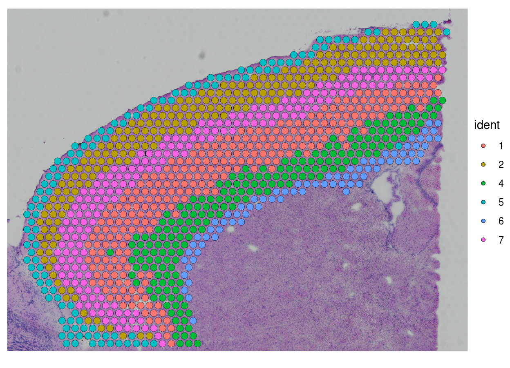

# A Quick Tour of GSimp

# 1. Introduction

SChart is a computational framework that can directly map single cells back to their spatial coordinates in tissue sections based on scRNA-seq and ST data. This method provides a new paradigm that is distinct from ST deconvolution, enabling a more flexible and direct investigation of single cell data with spatial topography. The SChart toolkit also provides two downstream analysis modules, including SColoc for spatial colocalization analysis and SCoexp for spatial co-expression analysis.

In this tutorial, we will demonstrate the cell charting workflow based on the mouse brain data as part of our paper Figure 2

# 2. Preparation
We start by loading the packages needed for the analyses.
``` r
options(stringsAsFactors = F)
library("dplyr")
library("magrittr")
library("dbscan")
library("pheatmap")
library("spatstat")
library("Seurat")
library("SeuratData")
library("reshape2")
library("visNetwork")
library("shiny")
library("plotly")
library("viridis")
```

We then load mouse brain scRNA-seq and ST data, respectively. For ST data, we only used the frontal cortex region for this study. 
``` r
brain_st_cortex <- readRDS("/volumes/lab/users/she3-m/SCharting/mouse_brain/R_data/brain_st_cortex.rds")
brain_sc <- readRDS("/volumes/lab/users/she3-m/SCharting/mouse_brain/R_data/brain_sc.rds")
## Visualize the ST data
SpatialDimPlot(brain_st_cortex)
```


``` r
## Visualize the scRNA-seq data
DimPlot(brain_sc, label = T, label.size = 4.5)
```


Mouse brain data tutorial: [Here](vignette_files/MouseBrainSChartExample.pdf)
