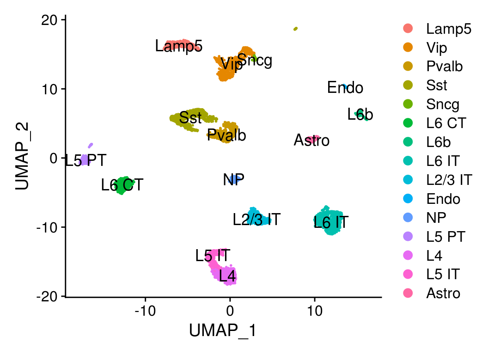
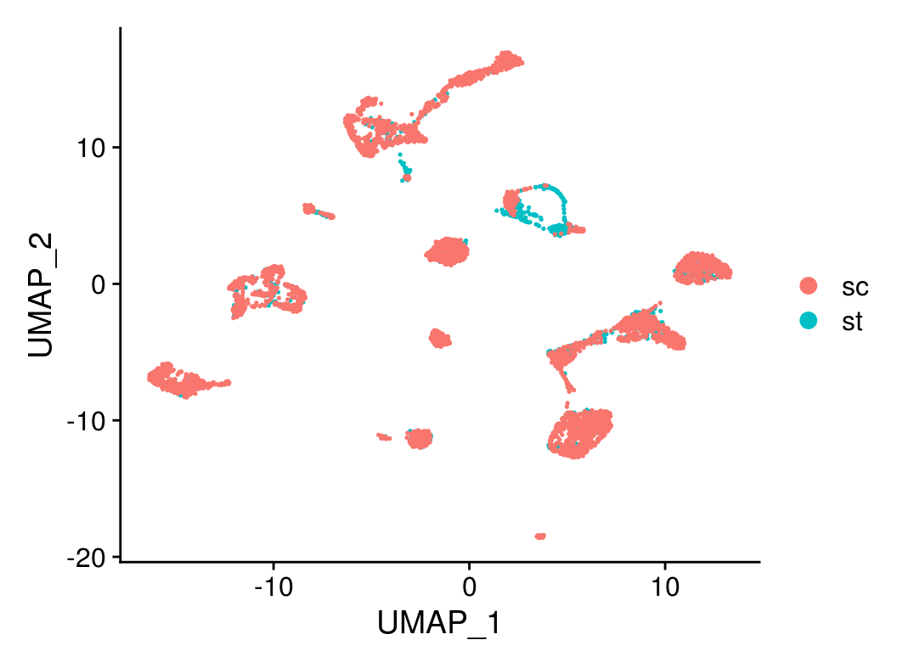
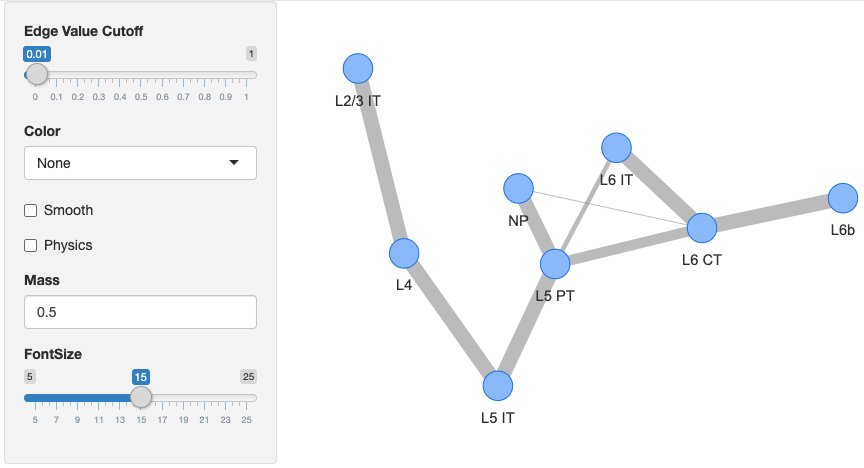
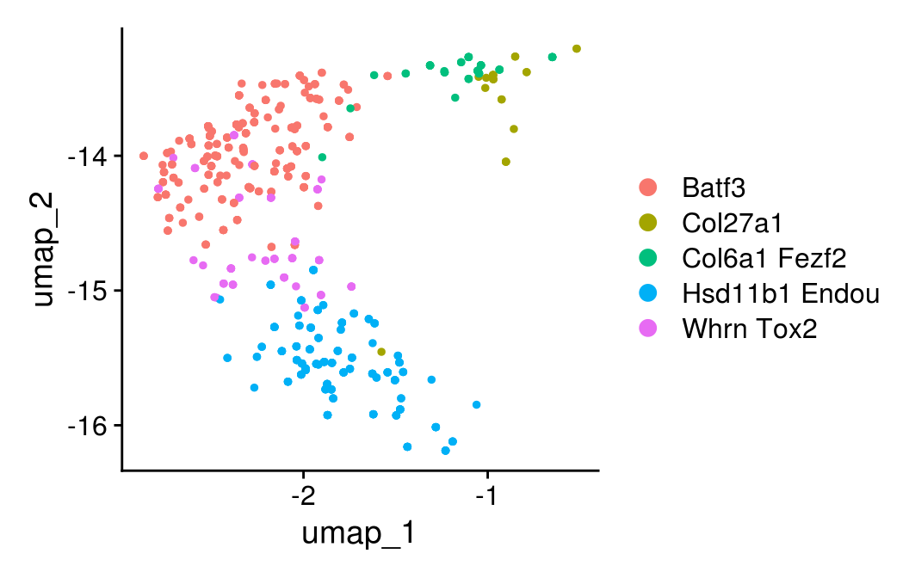
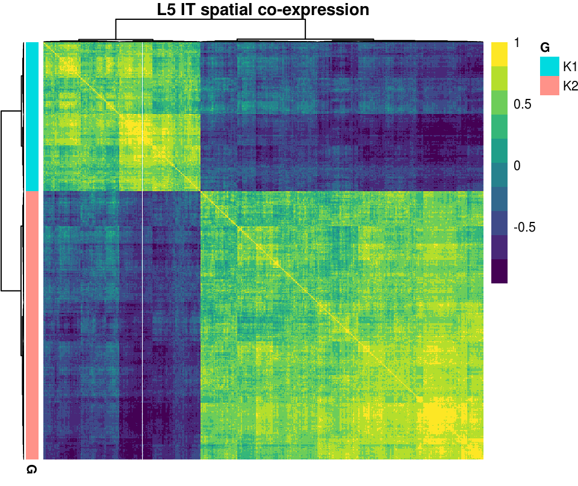
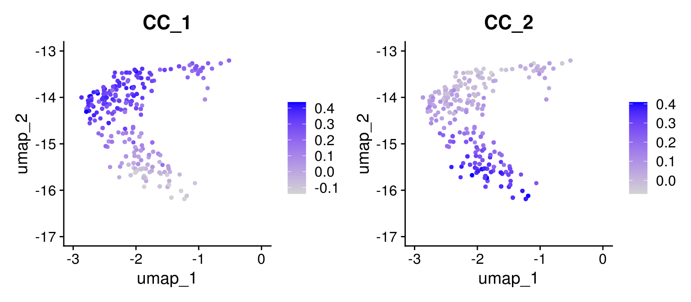

# A Quick Tour of CellTrek toolkit


# 1. Introduction and installation
CellTrek is a computational framework that can directly map single cells back to their spatial coordinates in tissue sections based on scRNA-seq and ST data. This method provides a new paradigm that is distinct from ST deconvolution, enabling a more flexible and direct investigation of single cell data with spatial topography. The CellTrek toolkit also provides two downstream analysis modules, including SColoc for spatial colocalization analysis and SCoexp for spatial co-expression analysis.

In this tutorial, we will demonstrate the cell charting workflow based on the mouse brain data as part of our paper Figure 2
``` r
library(devtools)
install_github("navinlabcode/CellTrek")
```
# 2. Loading the packages and datasets (scRNA-seq and ST data)
We start by loading the packages needed for the analyses. Please install them if you haven't.
``` r
options(stringsAsFactors = F)
library("CellTrek")
library("akima")
library("randomForestSRC")
library("packcircles")
library("dplyr")
library("magrittr")
library("dbscan")
library("pheatmap")
library("spatstat")
library("Seurat")
library("SeuratData")
library("reshape2")
library("visNetwork")
library("shiny")
library("plotly")
library("viridis")
library("RColorBrewer")
library("ConsensusClusterPlus")
library("philentropy")

```
We then load mouse brain scRNA-seq and ST data, respectively. For ST data, we only used the frontal cortex region for this study. For scRNA-seq data, if you are running the code on a personal laptop, you may need to subset the scRNA-seq data to hundreds of cells since it will cost several minutes for using the whole scRNA-seq data in the CellTrek step.

You can download the scRNA-seq data here: https://www.dropbox.com/s/ruseq3necn176c7/brain_sc.rds?dl=0

You can download the ST data here: https://www.dropbox.com/s/azjysbt7lbpmbew/brain_st_cortex.rds?dl=0
``` r
brain_st_cortex <- readRDS("brain_st_cortex.rds")
brain_sc <- readRDS("brain_sc.rds")
## Visualize the ST data
SpatialDimPlot(brain_st_cortex)
```


``` r
## Visualize the scRNA-seq data
DimPlot(brain_sc, label = T, label.size = 4.5)
```


# 3. Cell charting using CellTrek
We first co-embed ST and scRNA-seq datasets using *traint*
``` r
brain_traint <- CellTrek::traint(st_data=brain_st_cortex, sc_data=brain_sc, sc_assay='RNA', cell_names='cell_type')
```
``` r
## Finding transfer anchors... 
## Using 2000 features for integration... 
## Data transfering... 
## Creating new Seurat object... 
## Scaling -> PCA -> UMAP...
```
``` r
## We can check the co-embedding result to see if there is overlap between these two data modalities
DimPlot(brain_traint, group.by = "type") 
```

After coembedding, we can chart single cells to their spatial locations. Here, we use the non-linear interpolation (intp = T, intp_lin=F) approach to augment the ST spots.
``` r
brain_celltrek <- CellTrek::celltrek(st_sc_int=brain_traint, int_assay='traint', sc_data=brain_sc, sc_assay = 'RNA', 
                                   reduction='pca', intp=T, intp_pnt=5000, intp_lin=F, nPCs=30, ntree=1000, 
                                   dist_thresh=0.55, top_spot=5, spot_n=5, repel_r=20, repel_iter=20, keep_model=T)$celltrek
```
``` r
## Distance between spots is: 138 
## Interpolating...
## Random Forest training... 
## Random Forest prediction...  
## Making distance matrix... 
## Making graph... 
## Pruning graph...
## Spatial Charting SC data...
## Repelling points...
## Creating Seurat Object... 
## sc data...
```
After cell charting, we can interactively visualize the CellTrek result using *celltrek_vis*
``` r
brain_celltrek$cell_type <- factor(brain_celltrek$cell_type, levels=sort(unique(brain_celltrek$cell_type)))

CellTrek::celltrek_vis(brain_celltrek@meta.data %>% dplyr::select(coord_x, coord_y, cell_type:id_new),
                       brain_celltrek@images$anterior1@image, brain_celltrek@images$anterior1@scale.factors$lowres)
```
We select “cell_type” from the “Color” option and set “Categorical” from “Type” option.


# 4. Cell colocalization analysis
Based on the CellTrek result, we can summarize the colocalization patterns between different cell types using SColoc module. Here, we are using glutamatergic neuron cell types as an example (it is recommended to remove some cell types with very few cells, e.g., n<20).
We first subset the glutamatergic neuron cell types from our charting result.
``` r
glut_cell <- c('L2/3 IT', 'L4', 'L5 IT', 'L5 PT', 'NP', 'L6 IT', 'L6 CT',  'L6b')
names(glut_cell) <- make.names(glut_cell)
brain_celltrek_glut <- subset(brain_celltrek, subset=cell_type %in% glut_cell)
brain_celltrek_glut$cell_type %<>% factor(., levels=glut_cell)
```
Then we can use scoloc module to perform colocalization analysis.
``` r
brain_sgraph_KL <- CellTrek::scoloc(brain_celltrek_glut, col_cell='cell_type', cell_min=15, use_method='KL', eps=1e-50)
```
``` r
## 1  2  3  4  5  6  7  8  9  10  11  12  13  14  15  16  17  18  19  20
```
``` r
## We extract the minimum spanning tree (MST) result from the graph
brain_sgraph_KL_mst_cons <- brain_sgraph_KL$mst_cons
rownames(brain_sgraph_KL_mst_cons) <- colnames(brain_sgraph_KL_mst_cons) <- glut_cell[colnames(brain_sgraph_KL_mst_cons)]
brain_cell_class <- brain_celltrek@meta.data %>% dplyr::select(id=cell_type, class=class) %>% unique
```
Next, we can visualize the colocalization result. Feel free to adjust the edge value cutoff.
``` r
CellTrek::scoloc_vis(brain_sgraph_KL_mst_cons, meta_data=brain_cell_class)
```

# 5. Spatial-weighted gene co-expression analysis within the cell type of interest
Based on the CellTrek result, we can further investigate the co-expression patterns within the cell type of interest using SCoexp module. Here, we will take L5 IT cells as an example using consensus clustering (CC) method.
L5 IT cells first are extracted from the charting result.
``` r
brain_celltrek_l5 <- subset(brain_celltrek, subset=cell_type=='L5 IT')
brain_celltrek_l5@assays$RNA@scale.data <- matrix(NA, 1, 1)
brain_celltrek_l5$cluster <- gsub('L5 IT VISp ', '', brain_celltrek_l5$cluster)
DimPlot(brain_celltrek_l5, group.by = 'cluster')
```

We select top 2000 variable genes (exclude mitochondrial, ribosomal and high-zero genes)
``` r
brain_celltrek_l5 <- FindVariableFeatures(brain_celltrek_l5)
vst_df <- brain_celltrek_l5@assays$RNA@meta.features %>% data.frame %>% mutate(id=rownames(.))
nz_test <- apply(as.matrix(brain_celltrek_l5[['RNA']]@data), 1, function(x) mean(x!=0)*100)
hz_gene <- names(nz_test)[nz_test<20]
mt_gene <- grep('^Mt-', rownames(brain_celltrek_l5), value=T)
rp_gene <- grep('^Rpl|^Rps', rownames(brain_celltrek_l5), value=T)
vst_df <- vst_df %>% dplyr::filter(!(id %in% c(mt_gene, rp_gene, hz_gene))) %>% arrange(., -vst.variance.standardized)
feature_temp <- vst_df$id[1:2000]
```
We use scoexp to do the spatial-weighted gene co-expression analysis.
``` r
brain_celltrek_l5_scoexp_res_cc <- CellTrek::scoexp(celltrek_inp=brain_celltrek_l5, assay='RNA', approach='cc', gene_select = feature_temp, sigm=140, avg_cor_min=.4, zero_cutoff=3, min_gen=40, max_gen=400)
```
``` r
## Calculating spatial-weighted cross-correlation...
## Consensus clustering...
## Gene module detecting...
## 1  2  3  4  5  6  7  8
```
We can visualize the co-expression modules using heatmap.
``` r
brain_celltrek_l5_k <- rbind(data.frame(gene=c(brain_celltrek_l5_scoexp_res_cc$gs[[1]]), G='K1'), 
                           data.frame(gene=c(brain_celltrek_l5_scoexp_res_cc$gs[[2]]), G='K2')) %>% 
                           set_rownames(.$gene) %>% dplyr::select(-1)
pheatmap::pheatmap(brain_celltrek_l5_scoexp_res_cc$wcor[rownames(brain_celltrek_l5_k), rownames(brain_celltrek_l5_k)], 
                   clustering_method='ward.D2', annotation_row=brain_celltrek_l5_k, show_rownames=F, show_colnames=F, 
                   treeheight_row=10, treeheight_col=10, annotation_legend = T, fontsize=8,
                   color=viridis(10), main='L5 IT spatial co-expression')
```

We identified two distinct modules.
Based on our identified co-expression modules, we can calculated the module scores.
``` r
brain_celltrek_l5 <- AddModuleScore(brain_celltrek_l5, features=brain_celltrek_l5_scoexp_res_cc$gs, name='CC_', nbin=10, ctrl=50, seed=42)
## First we look into the coexpression module based on the scRNA-seq embedding
FeaturePlot(brain_celltrek_l5, grep('CC_', colnames(brain_celltrek_l5@meta.data), value=T))
```

Next we investigate the module scores at the spatial level.
``` r
SpatialFeaturePlot(brain_celltrek_l5, grep('CC_', colnames(brain_celltrek_l5@meta.data), value=T))
``` 

``` r
sessionInfo()
```
``` r
## R version 3.6.2 (2019-12-12)
## Platform: x86_64-pc-linux-gnu (64-bit)
## Running under: Red Hat Enterprise Linux
## 
## Matrix products: default
## BLAS:   /usr/lib64/R/lib/libRblas.so
## LAPACK: /usr/lib64/R/lib/libRlapack.so
## 
## locale:
##  [1] LC_CTYPE=en_US.UTF-8       LC_NUMERIC=C              
##  [3] LC_TIME=en_US.UTF-8        LC_COLLATE=en_US.UTF-8    
##  [5] LC_MONETARY=en_US.UTF-8    LC_MESSAGES=en_US.UTF-8   
##  [7] LC_PAPER=en_US.UTF-8       LC_NAME=C                 
##  [9] LC_ADDRESS=C               LC_TELEPHONE=C            
## [11] LC_MEASUREMENT=en_US.UTF-8 LC_IDENTIFICATION=C       
## 
## attached base packages:
## [1] stats     graphics  grDevices utils     datasets  methods   base     
## 
## other attached packages:
##  [1] viridis_0.5.1       viridisLite_0.3.0   plotly_4.9.3       
##  [4] ggplot2_3.3.3       shiny_1.5.0         visNetwork_2.0.9   
##  [7] reshape2_1.4.4      hdf5r_1.3.0         SeuratData_0.2.1   
## [10] Seurat_3.1.4.9904   spatstat_1.63-2     rpart_4.1-15       
## [13] nlme_3.1-148        spatstat.data_2.1-0 pheatmap_1.0.12    
## [16] dbscan_1.1-6        magrittr_2.0.1      dplyr_1.0.5        
## 
## loaded via a namespace (and not attached):
##   [1] philentropy_0.4.0           Rtsne_0.15                 
##   [3] colorspace_2.0-0            deldir_0.1-25              
##   [5] ellipsis_0.3.1              ggridges_0.5.3             
##   [7] farver_2.1.0                leiden_0.3.3               
##   [9] listenv_0.8.0               ggrepel_0.9.1              
##  [11] bit64_4.0.2                 RSpectra_0.16-0            
##  [13] fansi_0.4.2                 codetools_0.2-16           
##  [15] splines_3.6.2               knitr_1.31                 
##  [17] polyclip_1.10-0             jsonlite_1.7.2             
##  [19] ica_1.0-2                   cluster_2.1.0              
##  [21] png_0.1-7                   uwot_0.1.8                 
##  [23] data.tree_1.0.0             sctransform_0.2.1          
##  [25] DiagrammeR_1.0.6.1          compiler_3.6.2             
##  [27] httr_1.4.2                  randomForestSRC_2.10.1     
##  [29] CellTrek_0.0.0.9000       assertthat_0.2.1           
##  [31] Matrix_1.2-18               fastmap_1.0.1              
##  [33] lazyeval_0.2.2              cli_2.0.2                  
##  [35] later_1.1.0.1               htmltools_0.5.1.1          
##  [37] tools_3.6.2                 rsvd_1.0.3                 
##  [39] igraph_1.2.6                gtable_0.3.0               
##  [41] glue_1.4.2                  RANN_2.6.1                 
##  [43] rappdirs_0.3.3              Rcpp_1.0.6                 
##  [45] Biobase_2.46.0              vctrs_0.3.7                
##  [47] debugme_1.1.0               ape_5.4                    
##  [49] lmtest_0.9-38               xfun_0.22                  
##  [51] stringr_1.4.0               globals_0.14.0             
##  [53] akima_0.6-2.1               mime_0.10                  
##  [55] miniUI_0.1.1.1              lifecycle_1.0.0            
##  [57] irlba_2.3.3                 goftest_1.2-2              
##  [59] future_1.21.0               packcircles_0.3.4          
##  [61] MASS_7.3-51.6               zoo_1.8-9                  
##  [63] scales_1.1.1                promises_1.2.0.1           
##  [65] spatstat.utils_2.1-0        parallel_3.6.2             
##  [67] RColorBrewer_1.1-2          yaml_2.2.1                 
##  [69] reticulate_1.16             pbapply_1.4-2              
##  [71] gridExtra_2.3               stringi_1.5.3              
##  [73] highr_0.8                   BiocGenerics_0.32.0        
##  [75] rlang_0.4.10                pkgconfig_2.0.3            
##  [77] evaluate_0.14               lattice_0.20-41            
##  [79] ROCR_1.0-11                 purrr_0.3.4                
##  [81] tensor_1.5                  labeling_0.4.2             
##  [83] patchwork_1.0.1             htmlwidgets_1.5.3          
##  [85] cowplot_1.0.0               bit_4.0.4                  
##  [87] tidyselect_1.1.0            parallelly_1.24.0          
##  [89] RcppAnnoy_0.0.18            plyr_1.8.6                 
##  [91] R6_2.5.0                    generics_0.1.0             
##  [93] DBI_1.1.0                   withr_2.4.1                
##  [95] pillar_1.5.1                mgcv_1.8-31                
##  [97] fitdistrplus_1.1-1          sp_1.4-5                   
##  [99] survival_3.2-3              abind_1.4-5                
## [101] tibble_3.1.0                future.apply_1.7.0         
## [103] tsne_0.1-3                  crayon_1.4.1               
## [105] KernSmooth_2.23-17          utf8_1.2.1                 
## [107] rmarkdown_2.3               grid_3.6.2                 
## [109] data.table_1.14.0           blob_1.2.1                 
## [111] ConsensusClusterPlus_1.50.0 digest_0.6.27              
## [113] xtable_1.8-4                tidyr_1.1.3                
## [115] httpuv_1.5.5                munsell_0.5.0
``` 
